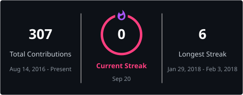

 

## ⚡ About

Principal Front-End Engineer / Tech Lead specializing in **scalable web platforms, real-time systems, and front-end architecture**. Modern Angular (v17–18+): SSR/SSG, signals-based architecture, large-scale **Nx monorepos**. Experience across fintech, crypto (Web3), healthcare, geospatial, and mobility (EV).

| 🏗️ **100+** | 🚀 **-40–60%** | 📦 **100k+ LOC** | 📈 **+20–30%** |
|:---:|:---:|:---:|:---:|
| repos in one Nx monorepo | CI build time cut | AngularJS → Angular 18 migrated | Core Web Vitals gains |

## 🤖 AI Engineering

AI as part of the engineering system, not a chat window — certified in **[AI Agentic Engineering](https://certificates.neoversity.com.ua/verify?certId=1080&lang=ENG&type=pass)** (Neoversity, Senior Engineering Track, 2026) and applying it daily in enterprise work.

| | |
|---|---|
| 🧭 **AI-harness architecture** | Rules, reusable skills, subagents (planner · implementer · reviewer · tester · verifier), hooks as guardrails |
| 📐 **Spec-Driven Development** | requirements → spec → plan → implementation → verification — merge-ready PRs |
| 🔌 **MCP servers** | Custom Model Context Protocol servers wiring agents to GitHub, trackers, and internal enterprise services |
| ✅ **AI verification in CI** | Custom CI agents: plan verifiers, cross-model review, automated quality gates |
| 🕸️ **Multi-agent orchestration** | Parallel worktree fan-out, adversarial review, per-run cost control |
| 📊 **Evals, cost & AG-UI** | Trace-based evals for LLM features, cost reporting, agent-user interfaces in enterprise apps |

🎓 Capstone: **[DevDigest](https://github.com/AndriiSiuta/dev-digest)** — GitHub-connected AI code review with custom reviewer agents, MCP integrations, CI verification, and an eval pipeline.

## 🛠️ Arsenal

**Core**

**State & Architecture**

**Rendering & Performance**

**Testing & CI/CD**

**AI & Agents**

## 📊 GitHub Analytics

<!-- Contribution snake: enable after granting `workflow` scope (gh auth refresh -s workflow)
     and restoring .github/workflows/snake.yml — then uncomment:

## 🐍 Contributions

<picture>
  <source media="(prefers-color-scheme: dark)" srcset="https://raw.githubusercontent.com/AndriiSiuta/AndriiSiuta/output/github-snake-dark.svg" />
  
</picture>

-->

